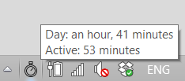

# Time in PC

A Windows application to keep track of time spent in computer.

It runs on the taskbar and when hovering mouse over it, it shows:
- Day: Total time in PC for today, includes inactive periods during the day.
- Active: Time Active in PC for today (excludes inactive periods).

During a working day in computer there might be periods where we stop active use of PC (but are still working), for a meeting, a call, figure something out on paper, etc... So i think is usefull to see both numbers: total time and just active time.

To allow re-use of the data collected, it exports to a csv file (timeinPC.csv), on a daily basis, a summary with the time spent on PC:
- Date: of the day
- Active (minutes): Minutes active in Computer
- Day start time
- Day end time

(Day end time - Day start time), gives the total time in PC for the day (including inactive periods) 

Make it a Startup app**, and let it run on background, no need to input any data or worry about it.

** Startup Folder: C:\Users\<username>\AppData\Roaming\Microsoft\Windows\Start Menu\Programs\Startup

## Run Requirements
- Microsoft Windows
- .NET Framework

## Development Requirements
- F# .NET, open it up in Visual Studio and it should just work.
- Packages:
    + Install-Package System.Data.SQLite.Core
    + Install-Package Costura.Fody

